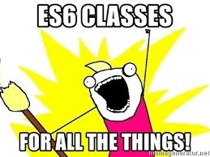

# ES6 classes

## Learning objectives

- How to define a Class
- How to add methods to a class
- Why an how to add a static method to a Class
- How to extend a class from another
- Metaprogramming and symbols
