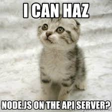

# NodeJS Basics

## Learning objectives

- Run JavaScript using NodeJS
- Use NodeJS modules
- Use specific Node JS module to read files
- Use `process` to access command line arguments and the environment
- Create a small HTTP server using Node JS
- Create a small HTTP server using Express JS
- Create advanced routes with Express JS
- Use ES6 with Node JS with Babel-node
- Use Nodemon to develop faster
